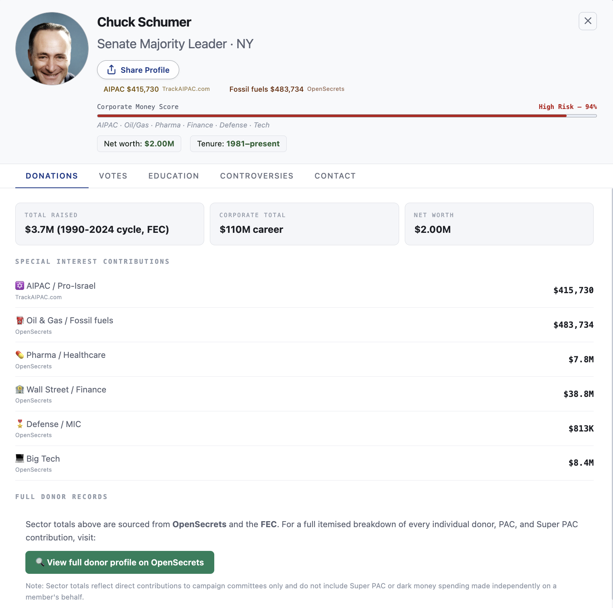
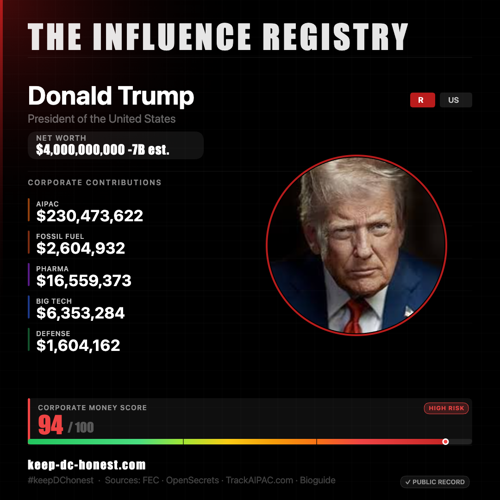

# The Influence Registry

A free, open-source, public-data tool for tracking corporate money in U.S. government.

🌐 **Live site:** [keep-dc-honest.com](https://keep-dc-honest.com)

The Influence Registry profiles every member of Congress, the Cabinet, and the Supreme Court using publicly available campaign finance and ethics data. It's built so anyone can decide for themselves whether their representatives are working for them. 

---

## Screenshots

<!-- Drop screenshots in /docs/screenshots/ and update the paths below -->


*Hemicycle charts showing how corporate money is distributed across Congress*


*Each member has a full profile with donations, voting record, education, and conflicts of interest*


*Generate shareable cards for any profile*

---

## What It Tracks

- **AIPAC and pro-Israel PAC contributions** (TrackAIPAC.com, FEC)
- **Fossil fuel industry donations** (OpenSecrets, FEC)
- **Pharmaceutical and healthcare PACs** (OpenSecrets, FEC)
- **Defense contractor donations** (OpenSecrets, FEC)
- **Big Tech contributions** (OpenSecrets, FEC)
- **Wall Street and finance industry money** (OpenSecrets, FEC)
- **Net worth disclosures** (Congressional financial disclosures)
- **Voting records** (Congress.gov, GovTrack)
- **Ethics concerns and conflicts of interest** (ProPublica, public reporting)
- **Stock trading activity** (House and Senate disclosure databases)

---

## Data Sources

All data comes from open-source, public records. No proprietary or paywalled sources are used.

| Source | What we use it for |
|---|---|
| [FEC.gov](https://www.fec.gov) | Campaign finance, PAC contributions |
| [OpenSecrets](https://www.opensecrets.org) | Career sector donation totals |
| [TrackAIPAC.com](https://trackaipac.com) | AIPAC and pro-Israel PAC contributions |
| [ProPublica](https://www.propublica.org) | SCOTUS financial disclosures |
| [Congress.gov](https://www.congress.gov) | Voting records, biographical data |
| [Bioguide](https://bioguide.congress.gov) | Member IDs, photos |
| [GovTrack](https://www.govtrack.us) | Legislative activity |

For the full methodology behind the Corporate Money Score and how each metric is calculated, see [METHODOLOGY.md](METHODOLOGY.md).

---

## How it's built

- **Frontend:** Vanilla HTML/CSS/JS — no framework, no build step, no JavaScript bundler
- **Hosting:** Netlify (static site)
- **Data pipeline:** Python scripts in [`/scripts`](scripts/) that pull from FEC, OpenSecrets, and TrackAIPAC into the JSON files in [`/data`](data/)
- **Updated regularly** as new FEC filings and disclosures become available

---

## Running the data pipeline locally

If you want to refresh the data yourself:

1. Get a free FEC API key at [api.data.gov/signup](https://api.data.gov/signup/)
2. Clone this repo
3. Copy `.env.example` to `.env` and add your key:
```bash
